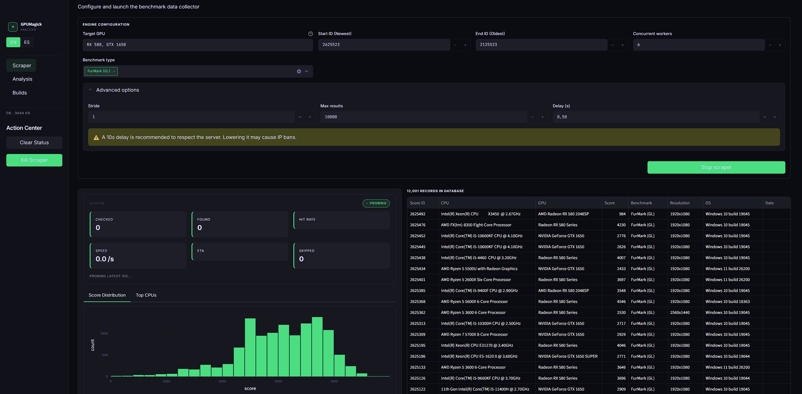
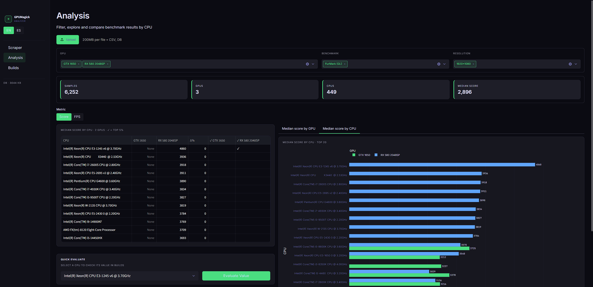
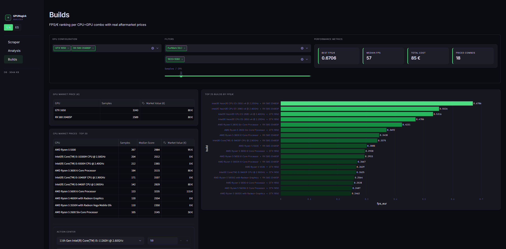

# GPUMagick Pro Scraper 🚀

### 🛠️ De IT Helpdesk a Desarrollador de Herramientas con IA

Este proyecto representa mi evolución profesional en el mundo de IT. Como perfil de **Helpdesk**, mi día a día suele ser resolver problemas técnicos. Este scraper es el resultado de mi curiosidad por ir más allá: **¿Qué pasa cuando combinas la experiencia en sistemas con el poder de la Inteligencia Artificial?**

He diseñado y supervisado la construcción de esta herramienta modular asíncrona utilizando IA avanzada, asegurando que cada pieza (desde la base de datos hasta la interfaz) cumpla con estándares de ingeniería profesional.

---

## 🌟 Características Principales

- **Arquitectura Modular Asíncrona:** Construido con `asyncio` y `aiohttp` para un rendimiento máximo sin bloquear el sistema.
- **Interfaz "Pro-Dev":** Dashboard oscuro personalizado en Streamlit con telemetría en tiempo real.
- **Persistencia Robusta:** Integración con SQLite para el manejo eficiente de miles de registros de GPUs.
- **Control de Procesos Inteligente:** Gestión de procesos mediante PID para evitar motores huérfanos y asegurar la estabilidad del sistema.
- **Scraping Ético:** Configurado por defecto con un delay de 10s para respetar los términos del servidor.

## 🏗️ Estructura del Proyecto

- `/scraper/`: El motor. Maneja la red, el parseo de datos y la base de datos.
- `app.py`: La cara visible. Un dashboard elegante para visualizar el progreso y los resultados.
- `cli.py`: Versión de línea de comandos para automatización pura.

## 🚀 Guía de Inicio Rápido

### 1. Requisitos Previos
Asegúrate de tener Python 3.9+ instalado. Clona el repositorio y entra en la carpeta:
```bash
git clone https://github.com/zenmode-adri/gpumagick-pro-scraper.git
cd gpumagick-pro-scraper
```

### 2. Instalación de Dependencias
Instala las librerías necesarias:
```bash
pip install streamlit pandas plotly aiohttp aiosqlite psutil
```

### 3. Lanzar la Aplicación
Ejecuta la interfaz web con Streamlit:
```bash
streamlit run app.py
```

## 📖 Cómo se usa

1.  **Configuración:** En la pestaña **"Extractor"**, introduce la GPU que quieres buscar (ej: `RX 580`) y el rango de IDs.
2.  **Extracción:** Pulsa **"Ejecutar"**. Verás la telemetría en vivo y cómo se llena la base de datos local `gpumagick.db`.
3.  **Análisis:** Cambia a la pestaña **"Análisis"** para comparar el rendimiento de diferentes CPUs con esa GPU.
4.  **Ensambles:** En la pestaña **"Builds"**, introduce los precios de mercado y descubre qué combo ofrece más FPS por cada Euro invertido.

## 🧠 Reflexión sobre el Proceso

Este proyecto no se trata solo de código; se trata de **orquestación**. He aprendido a guiar a la IA para resolver problemas complejos de concurrencia, diseño de UI y arquitectura de software. Es una demostración de cómo la IA puede empoderar a perfiles técnicos para crear soluciones que antes estaban reservadas para equipos de desarrollo completos.

---
*Proyecto mantenido con orgullo por un entusiasta de la automatización en IT.*

## 📸 Vista Previa del Sistema

| Dashboard Principal | Análisis de Datos | Ranking de Ensambles (Builds) |
| :---: | :---: | :---: |
|  |  |  |

> *Nota: La estética del sistema está inspirada en terminales de alta fidelidad y dashboards de monitoreo profesional.*
